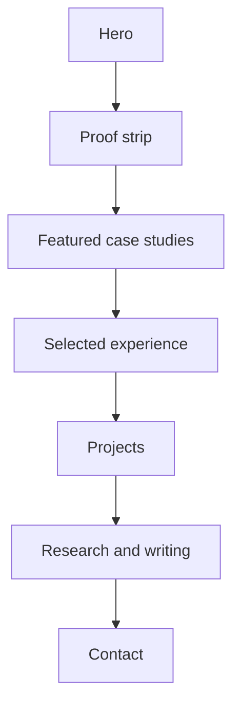

# Fatim Majumder Personal Site

Static personal website and GitHub Pages home for
[fatimmajumder.github.io](https://fatimmajumder.github.io).

## What the site is optimized for

- fast recruiter scanability in the first 10 to 15 seconds
- hard proof and systems depth for technical hiring managers
- deeper public-safe case studies for engineers evaluating judgment and rigor
- simple maintenance and zero-backend deployment on GitHub Pages

## Local development

The site is plain HTML, CSS, and JavaScript. No build step is required.

```bash
python3 -m http.server 4173
```

Then open [http://localhost:4173](http://localhost:4173).

## Deployment

This repo is designed to deploy directly from the default branch on GitHub
Pages.

- `index.html` is the homepage
- `styles.css` contains the shared visual system for the homepage and case studies
- `script.js` is progressive enhancement only for active nav highlighting
- `case-studies/` contains the public-safe engineering writeups
- `assets/` contains the favicon, social preview, and resume PDF
- `sitemap.xml` and `robots.txt` support crawlability

## Site structure



## Content rules

- Do not invent achievements, dates, employers, metrics, or links.
- Keep proof static in the HTML. Core credibility should not depend on JS.
- Preserve quantified outcomes whenever possible.
- Keep the site static and GitHub Pages friendly.
- Treat case studies as public-safe translations of real work, not speculative reconstructions.

## Related public repos

- [re-amp-audio-eval](https://github.com/fatimmajumder/re-amp-audio-eval)
- [traffic-collision-risk](https://github.com/fatimmajumder/traffic-collision-risk)
- [robust-kalman-localization](https://github.com/fatimmajumder/robust-kalman-localization)
- [quant-research-lab](https://github.com/fatimmajumder/quant-research-lab)
- [stochastic-optimization-notes](https://github.com/fatimmajumder/stochastic-optimization-notes)
- [diffusion-models-notes](https://github.com/fatimmajumder/diffusion-models-notes)
