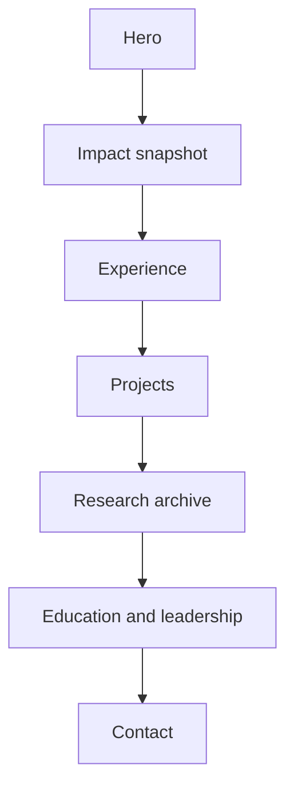

# Fatim Majumder Portfolio

Personal portfolio site and GitHub Pages home for
[fatimmajumder](https://github.com/fatimmajumder).

## Live site

[fatimmajumder.github.io](https://fatimmajumder.github.io)

## What this repo includes

- a recruiter-facing portfolio homepage
- project links to the main public showcase repos
- experience highlights mapped from the resume
- research/archive material pulled from the LinkedIn presentation history

## Site structure

- `index.html` for content and layout
- `styles.css` for the visual system and responsive behavior
- `script.js` for stat animations and interactions
- `assets/` for the favicon and downloadable resume PDF

## Site map

## Related repos

- [re-amp-audio-eval](https://github.com/fatimmajumder/re-amp-audio-eval)
- [traffic-collision-risk](https://github.com/fatimmajumder/traffic-collision-risk)
- [robust-kalman-localization](https://github.com/fatimmajumder/robust-kalman-localization)
- [quant-research-lab](https://github.com/fatimmajumder/quant-research-lab)
- [stochastic-optimization-notes](https://github.com/fatimmajumder/stochastic-optimization-notes)
- [diffusion-models-notes](https://github.com/fatimmajumder/diffusion-models-notes)
