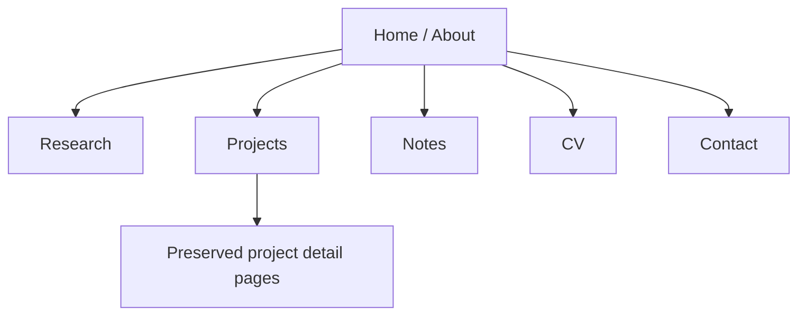

# Fatim Majumder Academic Homepage

Static academic research homepage and GitHub Pages site for
[fatimmajumder.github.io](https://fatimmajumder.github.io).

## What the site is optimized for

- professors, potential research advisors, PhD admissions readers, research labs, and mathematically serious ML groups
- a clear transition from Emory Computer Science and Mathematics into Columbia Applied Mathematics
- research direction in mathematical machine learning, scientific computing, optimization, statistical learning, AI for science, and reliable AI systems
- computational maturity shown through reproducible evaluation, benchmark design, statistical model comparison, graph learning, robust filtering, biomedical ML, and quantitative research systems
- fast, static, accessible deployment on GitHub Pages

## Local development

The site is plain HTML, CSS, and JavaScript. No build step is required.

```bash
python3 -m http.server 4173
```

Then open [http://localhost:4173](http://localhost:4173).

## Deployment

This repo is designed to deploy directly from the default branch on GitHub Pages.

- `index.html` is the academic homepage / about page
- `research.html` contains the research interests, research statement preview, and current questions
- `projects.html` reframes selected engineering work as computational research systems
- `notes.html` contains technical notes and writing
- `cv.html` is the academic CV page and links to the CV PDF
- `contact.html` contains research-oriented contact links
- `case-studies/` preserves deeper public-safe project detail pages for experience systems and selected computational projects
- `assets/` contains the favicon, social preview, academic CV PDF, and note PDFs
- `sitemap.xml` and `robots.txt` support crawlability

## Site structure



## Content rules

- Do not invent papers, advisors, lab affiliations, acceptances, publications, or Columbia details.
- Use Columbia wording carefully: incoming M.S. in Applied Mathematics, expected start Fall 2026.
- Keep the engineering background framed as evidence of computational research maturity, not the main identity.
- Prefer precise academic language over startup, recruiting, or product marketing language.
- Keep proof static in the HTML. Core credibility should not depend on JavaScript.
- Preserve useful case-study URLs even when the main site framing changes.

## Related public repos

- [re-amp-audio-eval](https://github.com/fatimmajumder/re-amp-audio-eval)
- [traffic-collision-risk](https://github.com/fatimmajumder/traffic-collision-risk)
- [robust-kalman-localization](https://github.com/fatimmajumder/robust-kalman-localization)
- [quant-research-lab](https://github.com/fatimmajumder/quant-research-lab)
- [stochastic-optimization-notes](https://github.com/fatimmajumder/stochastic-optimization-notes)
- [diffusion-models-notes](https://github.com/fatimmajumder/diffusion-models-notes)
